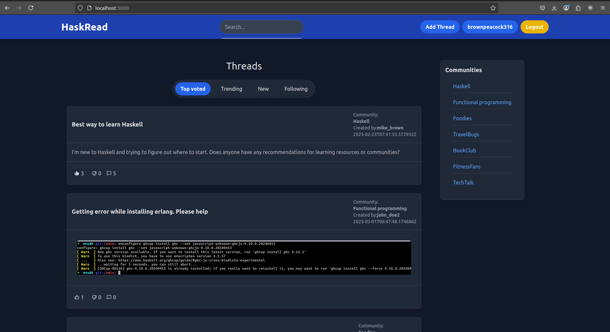

## HaskRead - Reddit clone written in Haskell

This is a Reddit clone written in Haskell. It is a work in progress. 
The goal of this project is to learn Haskell by building a real-world application. 
Will try to follow best practices and idiomatic Haskell as much as possible.

## Tech Stack

### Backend

- Haskell
- Servant
- QuickCheck
- Orville-PostgreSQL
- Aeson
- Tasty
- Lens
- Hedgehog
- Time
- Haxl
- Hyperbole

## ER Diagram

### Future Features

- [x] User registration
- [x] User authentication
- [x] User profile
- [x] User Change Password
- [x] User Delete Account
- [x] Admin authentication
- [x] Admin dashboard
- [x] Adding/Updating User Profile Picture
- [x] Admin Change Password
- [x] Create new admin using admin
- [x] Add/Remove Community by Admin
- [x] Log system
- [x] Take configuration from environment variables
- [x] Create Thread
- [x] Update Thread
- [x] Delete Thread
- [x] Create Comment
- [x] Update Comment
- [x] Delete Comment
- [x] Upvote Thread
- [x] Downvote Thread
- [x] Upvote Comment
- [x] Downvote Comment
- [x] Send Email verification mail
- [x] OAuth
- [ ] Adding Indices
- [ ] Adding Haxl
- [ ] Search Thread
- [ ] Search Comment
- [ ] Search User
- [ ] Search Admin
- [ ] Search Thread by Category
- [ ] Search Thread by Tag
- [ ] Search Thread by User
- [ ] Search Comment by User
- [ ] Search Comment by Thread
- [ ] Search Admin by User
- [ ] Search Admin by Thread
- [ ] Search Admin by Comment
- [ ] Search User by Thread
- [ ] Search User by Comment