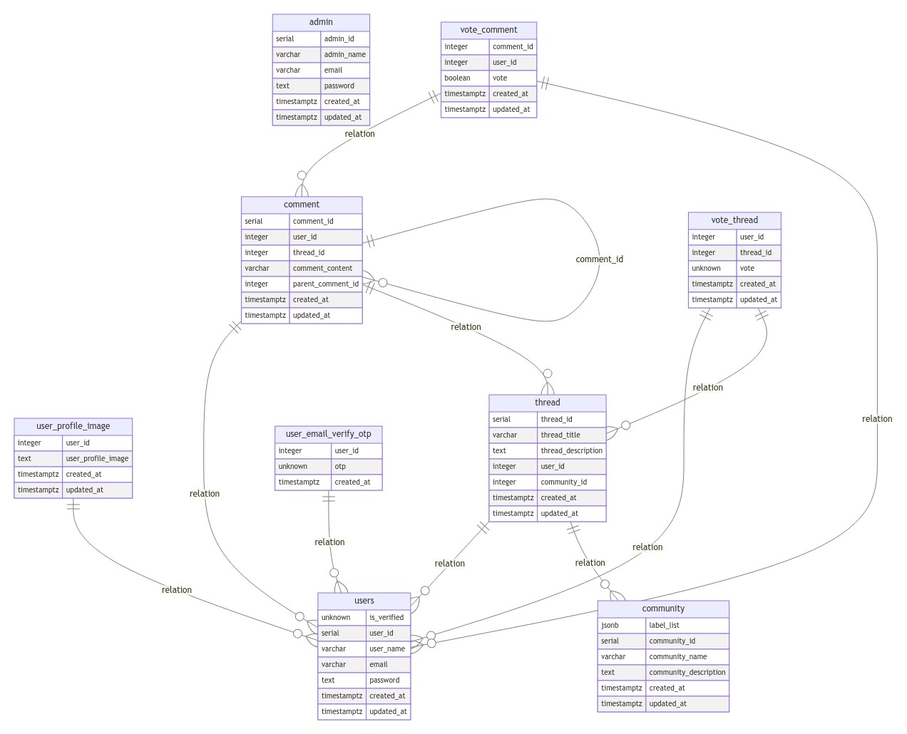

## HaskRead - Reddit clone written in Haskell

HaskRead is a Reddit clone web application build for learning building real world production application in Haskell.

## Setting up local development environment

The instructions for setting up setting local dev environment is provided in respective frontend and backend projects.

- [Frontend](./haskread-platform-ui/README.md)
- [Backend](./haskread-platform-be/README.md)

## Tech Stack

### Backend - Haskell ([Servant](https://docs.servant.dev/en/stable/))
### Frontend - Haskell ([Hyperbole](https://docs.hyperbole.live/simple))

## ER Diagram

### Key Web application functionalities that has been implemented so far:

#### User Authentication and Authorization

- Login, Register with email OTP, and password reset [here](./haskread-platform-be/src/Platform/Auth/Handler.hs)
- Implemented Google OAuth2 [here](./haskread-platform-be/haskread-platform-be/src/Platform/Auth/Handler.hs#L347)
- Access control to specific routes using [AuthResult](https://hackage.haskell.org/package/servant-auth-server-0.4.9.0/docs/Servant-Auth-Server.html#t:AuthResult)

#### Data management

- Database operations: Performed CRUD operations using Servant.
- Data Validation: Ensure data integrity by applying [sanity checks](./haskread-platform-be/src/Platform/Comment/Handler.hs#L40) before storing data.
- File Storage: Uploading documents (Image, docx, pdf) in [local storage](./haskread-platform-be/src/Platform/User/Thread/Handler.hs#L117) 
    (In future, It can be uploaded to storage buckets.)

#### API Development

- Restful API: Create endpoints for frontend or third-party applications to interact with the backend (./haskread-platform-be/src/Platform/API.hs).
- Implemented serveral core logics for the application and divided it in several different modules.

#### Error Handling and Logging

- Gracefully handling errors and returning meaningful responses for e.g [throw400Err](./haskread-platform-be/src/Platform/Common/Utils.hs#L57)
- Logging: Added Debug, Info, Warn, Error level logging mechanism using [FastLogger](https://hackage.haskell.org/package/fast-logger) [here](./haskread-platform-be/src/Platform/Log.hs)

#### Security

- Input sanitization: Used [Orville](https://github.com/flipstone/orville) postgres ORM to avoid SQL injection and type safety.
- Encryption: User passwords are encrypted using [Password](https://hackage.haskell.org/package/password).
- Rate limiting: Rate limiting is yet to be implemented.

#### Performance Optimization

- Caching - caching is partially implemented using [Haxl](https://github.com/facebook/Haxl) but being used.
- Database Indexing - Necessary fields are indexed.

#### Background Jobs and Task Queues

- Task queues/ Async processing - So far, there is no functionality in application that requires async or task queues.

#### Third party integration:

- Email services: Integrated MailGun API for sending verification emails.

#### Database Migrations and Seeding

- Migration and seeding: Migration and seeding has been implemented for initiating and popluating postgres data for testing with Orville.

#### Testing

- Unit tests with help of tasty-hunit and API testing with the help of tasty-wai has been implemented. [here](./haskread-platform-be/test/TestApp/Thread.hs)
- Written a bash script to perform testing on UI by fetching html pages using curl and checking if specific elements exist or not.

#### CI

- Github actions is being used to build be and ui, run test cases and deploy to GCP.

#### Scalability
- Nothing scalability related stuff has been implemented.
#### Compliance and Legal
- Nothing Compliance related measures has been taken since it is an application made for learning Haskell and not for real production app.
#### Analytics and Reporting
- Nothing related to Analytics has been implemented yet.
#### Notifications
- Push Notifications are yet to be implemented
#### Search Functionality
- Simple search functionality has been implemented with help of Vector Text search. [here](./haskread-platform-be/src/Platform/User/Thread/Handler.hs)
#### Versioning
- API Versioning is done (all apis are prefixed with v1)
#### Documentation
- Some Documentation exists in ./haskread-platform-be/Wiki but are unmaintained.
